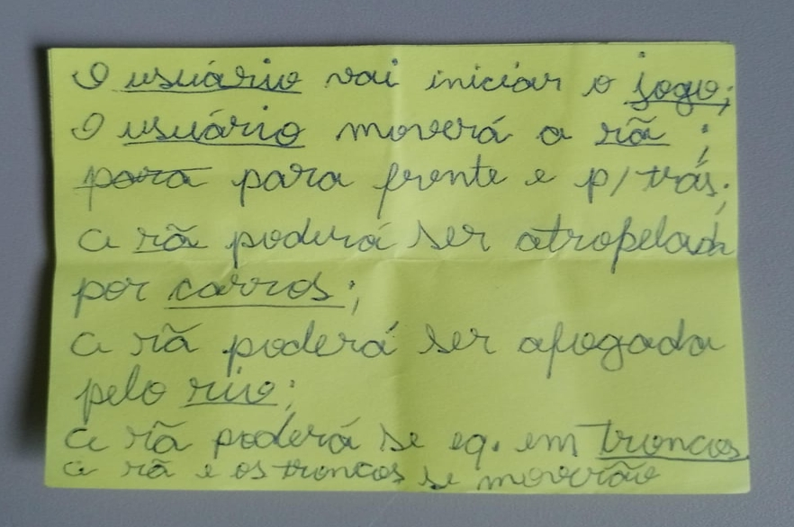

# Análise orientada a objeto
> [!NOTE]
> 
A <strong>análise</strong> orientada a objeto consiste nas duas primeiras etapas da tabela abaixo, a definição de casos de uso e a definição do domínio do problema. 

| Casos de uso | Domínio do problema | Diagrama de iteração | Diagrama de classes |
| ------------ | ------------------- | -------------------- | ------------------- |

## Casos de uso - The Frogger

| **`CASOS DE USO`** | Domínio do problema | Diagrama de iteração | Diagrama de classes |
| ------------------ | ------------------- | -------------------- | ------------------- |

Sendo o desenvolvimento dos casos de uso a primeira etapa da análise orientada a objeto, desenvolveu-se o seguinte rascunho de funcionamento do jogo:

* O **usuário** vai *iniciar* o **jogo**;
* O **usuário** *moverá* a **rã** para *frente e para trás*;
* A **rã** poderá ser *atropelada* por **carros**;
* A **rã** poderá ser *afogada* no **rio**;
* A **rã** poderá se *equilibrar* em **troncos**;
* A **rã** e os **troncos** se *moverão*;
* Os **troncos** poderão *ser diferentes*;
* Os **troncos** poderão *ser diferentes* dependendo da **corrente**;
* A *velocidade* dos **troncos** *será diferente* em cada **corrente**;
* Os **carros** se *moverão* em *velocidades* diferentes;
* Os **carros** poderão *ser diferentes* uns dos outros;
* Os **carros** terão *velocidades diferentes* dependendo da **pista**;
* Os **carros** *serão diferentes* dependendo da **pista**.
  
Onde os substantivos, em negrito, são os candidatos a atores/objetos/classes e os verbos/características em itálico são os candidadtos à métodos e atributos dos objetos. a primeira parte do rascunho original é mostrado na figura abaixo.

 

 
Apartir do rascunho principal de caso de uso, mostrado acima, foi construído uma tabela formal de casos de uso, a qual pode ser vista asseguir.
  

| Caso de uso:        | Jogar The Frogger                                                                                                     |
| :------------------ | :----------------------------------------------------------------------------------------------------------------- |
| Objetivo            | Este caso de uso descreve a lógica principal de uma partida de The Frogger                                            |
| Requisitos          | - `Menu de game` com `tabela de pontuações` anteriores, opção de start game e leave game;  - Esquema de vida e pontuação;  - Jogo de atravessar todos os `sapos` pela `rua` e pelo `rio` até a `toca`;  - O `jogo` deve mostrar o level no início de cada `partida`;  - `Temporizador` de partida;  - O `sapo` deverá ser movido em um plano x,y;  - A `partida` terá fixa 4 `faixas de trânsito`, duas `calçadas`, um `rio` com 4 `correntes` e 6 `tocas`;  - O `sapo` poderá ser atropelado;  - O `sapo` poderá ser afogado  - As `tocas` serão `vitória régias`;  - Cada `faixa de carro` possuirá 1 tipo de `carro` com velocidade diferente;  - Duas `correntes` do rio estarão carregando `troncos`, cada uma com `troncos` de um tamanho e velocidade prédefinida;  - Duas `correntes` possuirão `tartarugas` nadando no lado oposto aos `troncos` e cada `corrente` com uma velocidade;  - O `jogo` deve possuir uma `tela de game over`.          |
| Atores              | `jogador`                                                                                                            |
| Prioridade          | Alta                                                                                                               |
| Pré-condições       | - Interface gráfica deve ser carregada;  - Velocidades pré-definidas;  - Pontuações anteriores devem ser carregadas. |
| Frequência de uso   | Alta;                                                                                                              |
| Criticalidade       | Alta (É necessário implementar obrigatoriamente?);                                                                 |
| Condição de entrada | O `jogador` solicita nova partida                                                                                    |
| Fluxo principal     | 1. O `jogo` exibe o `menu de game` com um botão start `new game` e a `tabela de pontos` sobre a `tela de jogo`;  2. O `jogador` clica em start `new game`;  3. O `menu de game` desaparece e a `partida`(new game) se inicia;  4. O `trafego`, o `rio` e o `contador` se iniciam;  5. O `jogador` move o `sapo` pelo `mapa de jogo`;  6. O `sapo` chega à `toca(vitória régea)`;  7. O ``jogador`` é bonificado em pontos;  8. Se todas as vidas acabam e pelo menos 3 `sapos` chegam à `toca(vitória régea)`, o `jogo` atualiza o `registro de pontos` já feitos;  9. O `jogo` aumenta a dificuldade e retorna para o ítem 4..                                                                                                      |
| Fluxo alternativo   | A partir do ítem 1. do fluxo principal:   <blockquote style="color:white">2. O `jogador` clica em `leave game`;  3. O `jogo` se encerra;</blockquote> A partir do ítem 2. do fluxo principal:  <blockquote style="color:white"> 3. O `jogador` abandona a `partida`;  4. O `jogo` retorna para o ítem 1..</blockquote> A partir do ítem 5. do fluxo principal: <blockquote style="color:white">6. O `sapo` é morto;  <blockquote style="color:pink"> 6.1 O `sapo` é atropelado;  6.2 O `sapo` é afogado;  6.3 O `tempo` termina e o `sapo` não é levado à `toca`;</blockquote> 7. Uma vida é descontada do `jogador`;  8. Se o `jogador` ainda tiver vidas, o `jogo` retorna para o ítem 4..  9. Caso não haja mais vidas, a `tabela de pontuação` é atualizada e a `tela de game over` aparece por um tempo, mostrando as 5 melhores pontuações e a colocação da `partida` atual;  10. O jogo retorna para o ítem 1..</blockquote> |
| Pós condições       | Após a execução desse caso de uso, a `tabela de pontuação` com os 5 melhores resultados deve ser atualizada de acordo com a pontuação dessa `partida`.                                                                                                                                    |
| Regras de negócio   | 1. O `jogador` terá um `tempo` mínimo para atravessar cada `sapo`;  2. O `jogador` terá uma contagem de pontos máximos(HIT-SCORE);  3. O `jogador` terá uma contagem de vidas(1-UP), que será incrementada cada vez que o HIT-SCORE for atingido (100000 pontos);  4. O `jogo` possuirá uma `tabela de pontos`:  <blockquote style="color:gold">10 pts por cada passo em direção à `toca` do `sapo`(eixo y);  50 pts por cada `sapo` atravessado;  1000 pts por salvar todos os `sapos`;  10 pts por cada segundo sobrando(pts extra);</blockquote> 5. Cada `partida` dá ao `jogador` 6 vidas(sapos);  6. O `jogador` deve salvar 3 `sapos` para não perder a `partida`;                                                                                                         |
 
## Domínio do problema - The Frogger

| Casos de uso | **`DOMÍNIO DO PROBLEMA`** | Diagrama de iteração | Diagrama de classes |
| ------------ | ------------------------- | -------------------- | ------------------- |

 Com os casos de uso descritos textualmente, desenvolveu-se o seguinte pseudodiagrama de classes, afim de identificar os conceitos(objetos) e atributos relevantes no domínio do problema.

[Retroceder](README.md) | [Avançar](projeto.md)

